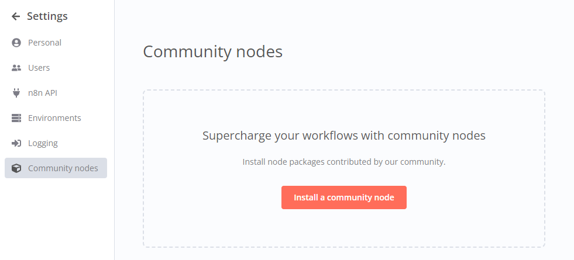
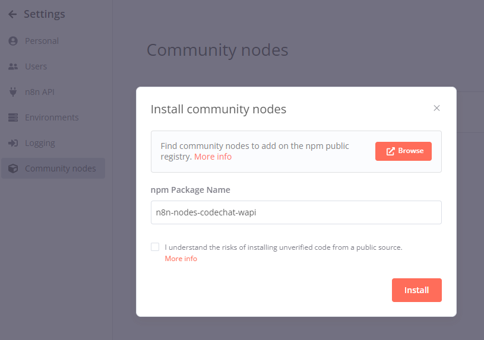
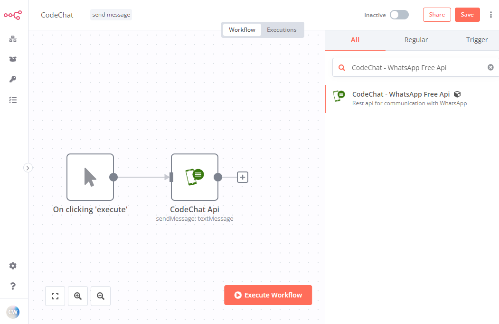
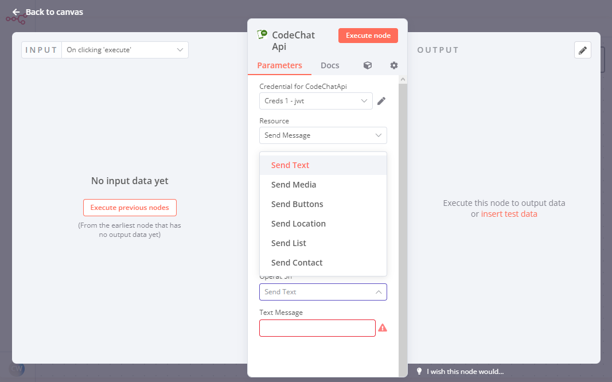
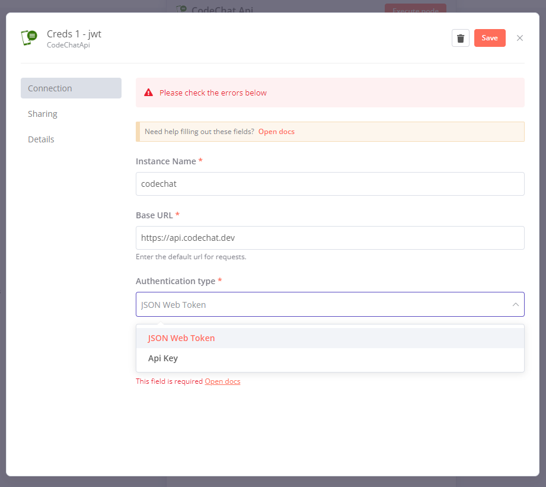

# n8n-nodes-codechat-wapi

This is a [N8n](https://community.n8n.io) community node. It allows you to use [WhatsApp Api](https://github.com/code-chat-br/whatsapp-api) which is a stripped down version of the official [CodeChat](https://github.com/code-chat-br) api to communicate with WhatsApp in your workflow.

This node sends the most common types of messages.

# Instalation

1. Go to Settings > Community Nodes, and Click Install a community node.

<div align="center">
	
</div>

2. Enter ```n8n-nodes-codechat-wapi``` in the npm Package Name field. And click Install.

<div align="center">
	
</div>

3. Once installed, you can use the search bar to add the CodeChat node to your workflow.

<div align="center">
	
</div>

<div align="center">
	
</div>

# Usage

The node configuration is quite simple, just specify the credentials and use the available operations.

# Credentials

All operations require credentials that are made up of:

1. Instance Name
2. Base URL
3. Authentication that can be of two types: **apikey** or **jwt**, as selected in the [env.yml](https://github.com/code-chat-br/whatsapp-api/blob/main/src/dev-env.yml) file.
	- For jwt pass zero for the expiration parameter. Ex.: EXPIRIN_IN: 0

<div align="center">
	
</div>

# Resources

This section describes which *WhatsApp API* operations are available on this node.

# Send Message

| Operation           | Method | Credentials required |
| --------------------|--------|----------------------|
| Send Text           | POST   | True                 |
| Send Buttons        | POST   | True                 |
| Send Media          | POST   | True                 |
| Send Location       | POST   | True                 |
| Send Contact        | POST   | True                 |
| Send List           | POST   | True                 |

# Compatibility

Tested on n8n version 0.206.1 and WahtsApp Api version 1.0.0

# Sample Workflow

[workflow-test-codechat-wapi](./workflow-test-codechat-wapi.json)

# License
[MIT](./LICENSE.md)
